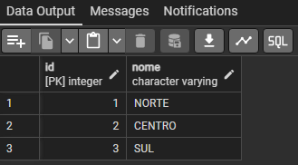

# Primeiro Projeto de Banco de Dados - SQL/PostgreSQL

Desenvolvimento de Primeiro Projeto de Banco de Dados com SQL/PostgreSQL. `Exercício 04, Módulo 01 (SQL).` 

Instituição: [Digital College Brasil](https://digitalcollege.com.br/) (Fortaleza/CE) <br>
Curso: Data Analytics (Turma 18) <br>
Instrutora: [NayaraWakweski](https://github.com/NayaraWakewski) <br>

<br>

## Etapas de Desenvolvimento

### 1ª Etapa
- Criar o banco de dados: digital (Através da interface gráfica).

<br>

### 2ª Etapa
- Criar a tabela: regiao.
```
CREATE TABLE IF NOT EXISTS public.regiao (
    id serial NOT NULL,
    nome character varying,
    CONSTRAINT regiao_pkey PRIMARY KEY (id);
);    
```

- Checar as colunas e tipos de dados que foram criados.
```
SELECT * FROM public.regiao;
```

- Visualização <br>


<br>

### 3ª Etapa
- Criar a tabela: departamento.
```
CREATE TABLE IF NOT EXISTS public.departamento (
    id serial NOT NULL,
    nome character varying,
    id_regiao integer,
    CONSTRAINT departamento_pkey PRIMARY KEY (id),
    CONSTRAINT departamento_id_regiao_fkey FOREIGN KEY (id_regiao)
        REFERENCES public.regiao (id)
);    
```

- Checar as colunas e tipos de dados que foram criados.
```
SELECT * FROM public.regiao;
```

- Visualização <br>


- Alterando o tipo de dado da coluna id (serial para integer).
```
ALTER TABLE public.departamento
ALTER COLUMN id TYPE integer;
```

<br>

### 4ª Etapa
- Inserir valores na tabela: regiao.
```
INSERT INTO public.regiao (nome) VALUES 
    ('NORTE'),
    ('CENTRO'),
    ('SUL');
```

- Checar valores inseridos na tabela: regiao.
```
SELECT * FROM public.regiao;
```

- Visualização <br>


<br>

### 5ª Etapa
- Inserir valores na tabela: departamento.
```
INSERT INTO public.departamento (id, nome, id_regiao) VALUES 
    (10, 'VENDAS', 1),
    (20, 'OPERAÇÕES', 1),
    (30, 'ADMINISTRATIVO', 2),
    (40, 'FINANCEIRO', 3);
```

- Checar valores inseridos na tabela: departamento.
```
SELECT * FROM public.departamento;
```

- Visualização <br>


## Meus Contatos

- Business Card - [Renato Albuquerque](https://rma-contacts.vercel.app/)
- Linkedin - [renato-malbuquerque](https://www.linkedin.com/in/renato-malbuquerque/)
- Discord - [Renato Albuquerque#0025](https://discordapp.com/users/992621595547938837)
